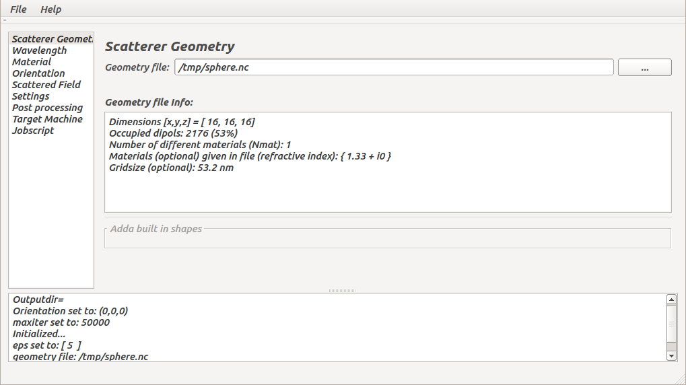

# Adda Run Configuration Assistent
A Qt based graphical front end to help set up parallel Adda runs and parameter studies.

## What is it?
The interface assists the user in to setting up parameter studies with an emphasis on atmospheric application (but not limited to). You are expected to be familiar with the Adda(1) command line options, its manual and generally running computations. The interface assists in setting up parallel runs for different target platforms (Cray XC30, generic PBS (clusters using a Torque scheduler), plain Linux and Windows), processor allocations, scanning over sequences of different parameters such as wavelenght, scatterer orientations or residual errors. The basic way of how this is achieved is to gather the required information with the user interface and map this to invocations of Adda instances set up with the according parameters. Technically, execution or job submission scripts are created. 

(1) [Adda](https://github.com/adda-team/adda)




## Supported Systems
Linux, Windows and other binary targets (desktop) supported by the used Qt development environment. 


## Installation
No binary releases are provided for now, you need to compile from source, using the system supplied Qt or
an installation from here: [https://www.qt.io/download-eval-for-applications-step-2/](https://www.qt.io/download-eval-for-applications-step-2/)

### All platforms
The subdirectories Materials, Orientations, Scattergrid and Wavelengths must exist relative to the binary. As an example, from using a Linux QtCreator build, the default target directoy is build-AddaFrontend-Desktop-Debug/.

To create: 
```
build-AddaFrontend-Desktop-Debug/
  Materials/
  Orientations/
  Scattergrid/
  Wavelengths/
```
use: 
```
cd build-AddaFrontend-Desktop-Release/
ln -s ../src/Materials .
ln -s ../src/Orientations .
ln -s ../src/Scattergrid .
ln -s ../src/Wavelengths .
```

### Linux
Provided Qt development packages and netCDF are installed, which on Ubuntu are

`sudo apt-get install libnetcdf-dev qt5-default qttools5-dev-tools`
 
or install the netCDF from source from here:
* [https://www.unidata.ucar.edu/downloads/netcdf/index.jsp](https://www.unidata.ucar.edu/downloads/netcdf/index.jsp), which has instructions for compiling here:
* [http://www.unidata.ucar.edu/software/netcdf/docs/getting_and_building_netcdf.html](http://www.unidata.ucar.edu/software/netcdf/docs/getting_and_building_netcdf.html)

and add paths to headers and libraries to the `.pro` file (see bottom).

compile with:

```
cd src
qmake
make
```
in the `src/`.

### Archer
```
module swap PrgEnv-cray PrgEnv-gnu
module load qt
module load cray-netcdf 
cd AddaFrontend/src
qmake
make
```

### Windows
Using a Qt SDK for Windows ([Qt](https://www.qt.io/download/)), MinGW kit works well, and an installation of netcdf[1]. 
Modify the location of the netcdf headers and .dll in the project file (bottom), load and build inside qtcreator.

[1] [http://www.unidata.ucar.edu/software/netcdf/docs/winbin.html](http://www.unidata.ucar.edu/software/netcdf/docs/winbin.html) 


## Usage
The application is best executed on the target machine. All file paths (inserted as absolute paths into the scripts) will automatically match the target system ensuring that they are correct at runtime of the script. If you generate scripts locally and then move them to a differenet machine you need to manually ensure that all file paths are available on the target platform and you need to have reachable copies of some of the parameter files (output scattering grid files for example) available in the correct place.

To set up a series of runs, step through the individual subpages of the interface on the left and enter your choices. Some of the fields (beige background) accept Octave/Matlab range syntax for entering number sequences: `start:step:stop`. As an example` 1:2:10` will evaluate to `1,3,5,7,9`.

The set up process is completed on the "Jobscript" page, where using the [Generate] button will write the selected type of script file to disc.

The options should be mostly self explanatory if you are familiar with Adda and it's user manual. Some additional notes on the specifc sections are below.

### Scatterer Geometry
Select a geometry definition netcdf file, a detailed description of the format can be found in here. The grid must carry grid size information in order that all required parameters can be computed correctly. This can be simply added using an NCO operator ([1]) by the following command if it was not contained in the geometry file (`geom` variable). The below example marks the grid size as 53.2nm.

```
ncatted -a gridsize_nm,geom,a,d,"53.2" geometryfile.nc
```
Currently, particles having more than one material domains (Nmat>1) are not supported. 

Materials (refractive indices) can also be read from the geometry file, if the are available as `material_re` and `material_im` attributes.

[1] [NCO](http://nco.sourceforge.net/), `Ubuntu: apt-get install nco`


### Wavelength
Select one or several wavelengths for Adda's `-lambda` option. You can add lists of wavelengths adding files into the Wavelengths/ subdirectory. For a configuration that covers several wavelenghts, the `-dpl` (number of dipoles per lambda) needs to be computed for each and for this the grid size of the geometry needs to be known. Using the same grid size for multiple wavelenghts results in a re-computed (and thus changing) `-dpl` parameter for every different wavelenght. It depends on the your specific use case, if this is suitable. You are presented with a warning should the value for one of the chosen wavelengths become lower than 10 dipoles per wavelength. One strategy can be to chose your minimum required dipoles per lambda setting for the smalles wavelengths of the sequence, or divide the range into sections using one geometry per section.


### Material
The materials (`-m` option in Adda) can be specified as constants, read from the geometry description or be made function of the wavelength. The currently available wavelength-linked scheme is for water ice only and implements:
Warren, S. G., and R. E. Brandt (2008), Optical constants of ice from the ultraviolet to the microwave: A revised compilation. J. Geophys. Res., 113, D14220, doi:10.1029/2007JD009744, following the interpolation scheme recommended  [there:](http://www.atmos.washington.edu/ice_optical_constants/) "For intermediate wavelengths not given in the table one should interpolate m_re linearly in log(wavelength); log(m_im) linearly in log(wavelength)."

### Orientation
Entering a single orientation  (`-orient ` option), choose a preset, or supply a list containing custom orientations (can be simply added to the `Orientations/` subdirectory).

The supplied "UH Scheme I" offers the following orientation sets:

Level 0:
* alpha = { 0 }
* beta  = { 0, 27, 38, 48, 56, 63, 77, 83, 90 };
* gamma = { 0 };

9 total orientations

Level 1:
* alpha = { 0 };
* beta = { 0, 27, 38, 48, 56, 63, 77, 83, 90 };
* gamma = { 15, 30 };

18 total orientations.

### Scattered Field
The grid used to compute the output fields are read from file. Choose one of the supplied ones, or add new grids by adding them into the Scattergrid/ directory. Matlab scripts supplied in the AddaTools repository are provided to generate suitable files. They are identical to the format as read by the `-scat_grid_inp` option.

### Settings
Supplying a dipole per lambda setting overrides the values computed using wavelength and the the gridsize_nm attribute. The additional commands field is appended to every adda commandline.

### Target Machine
Choose a target machine script type. 


### Archer
The resulting script can be checked for budget requirements (and problems) with 
```
checkScript scriptname
```
and submitted into the queue by
```
qsub scriptname
```
or if it is an array type script
```
qsub -J 1-999 
```

### Development platforms
Or known to work:

- QtCreator 2.7.2, based on Qt 5.1.0 (32bit, MinGW 4.8), Win 7 (32bit)
- QtCreator 3.0.1, based on Qt 5.2.1 (gcc 4.8.2, 64bit), Ubuntu 14.01

# License
GPLv3


